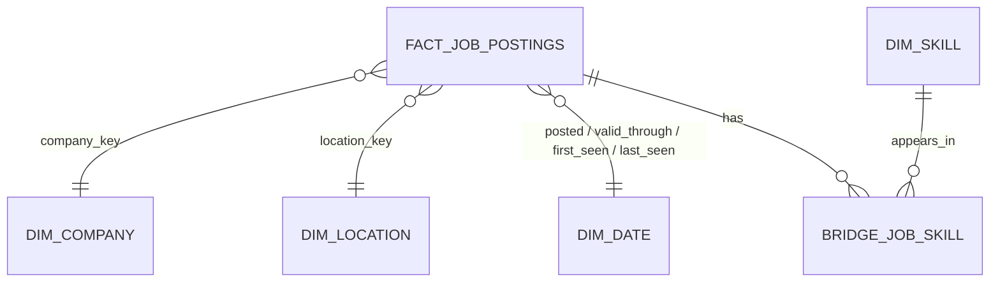

# Star schema

Grain: one row per unique job posting (source, job_key). Duplicates are flagged, not deleted.
Unknown members: company -1; location -1 (unspecified), -2 (remote), -3 (outside Kenya); date -1.